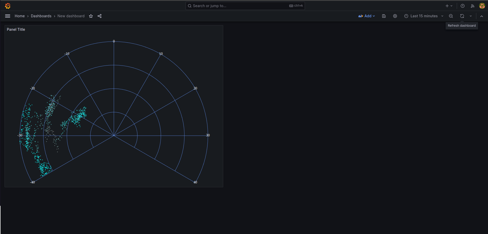
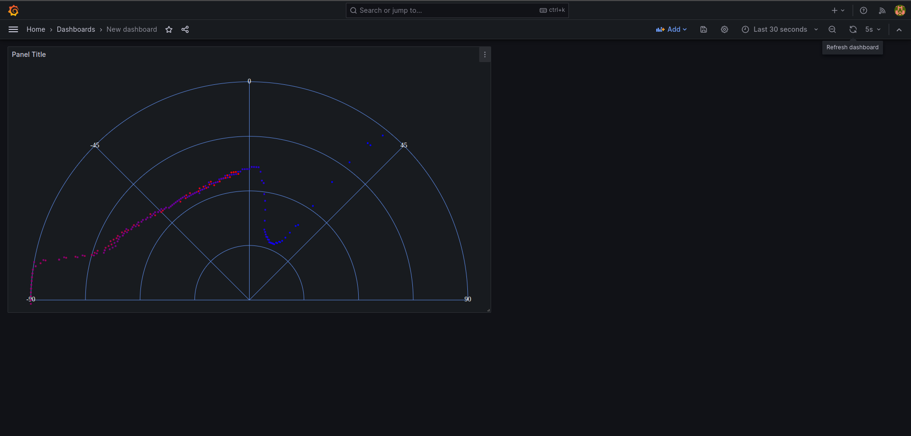

## Grafana radar panel
### About

The plugin is designed to visualize data in the polar coordinate system (this can be completely different data, such as information from radars, lidars, as well as visualization of, for example, microphone sensitivity). The input can be two sources of information in the standard version and three in the mode with the display of point strength. 

The input is data:
1 field is the 0-360 direction of the point
2 field is the distance from the zero point 0-100
3 field (optional) - the strength of the point, also this field can be the time (how old the point is) (and display in a gradient)

The gradient is specified by an array of colors in #******* hex (6 characters!), separated by a space. 
For example: 
#FF0000 #00FF00, the minimum value will be red, the maximum value will be green.
#FF0000 #00FF00, #0000FF, the minimum value will be red, about 50% of the value will be green, the maximum blue.

It is also possible to use not the 360 polar coordinate system (this is necessary when we have a narrowly directed radar), but for example from -90 to 90 degrees.


### Install

1. Install dependencies

   ```bash
   npm install
   ```

2. Build plugin in development mode and run in watch mode

   ```bash
   npm run dev
   ```
3. Run grafana docker container

   ```bash
   sudo docker-compose up -d
   ```
4. Go to 

   ```bash
   http://localhost:3001/
   ```

### Examples



